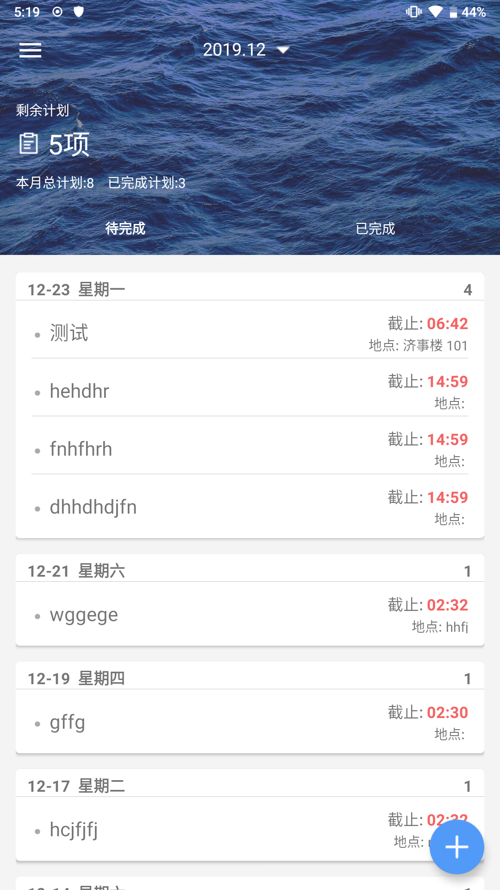

# 拾间 - 计划管理程序

1751130 朱宽

## 屏幕截图

## 项目结构

1. db

存放数据库实体类

2. gson

存放一些用于gson解析的临时类

3. present

mvp 中的 presenter 层. 这一层同样包含了主界面双层RecycleView的适配器.

4. ui

view 层

5. util

静态类工具类集合, 将一些高频操作(例如时间操作)抽象出来.

## 使用到的开源库

数据库操作使用了 [LitePal](https://github.com/LitePalFramework/LitePal). 每个实体除了一个自身类之外, 也有一个静态的工具类.

富文本编辑器使用了 [richeditor-android](https://github.com/wasabeef/richeditor-android)

圆形头像框使用了 [circleimageview](https://github.com/hdodenhof/CircleImageView)

图片加载器使用了 glide

图片选择器使用了了 [ImageSelector](https://github.com/smuyyh/ImageSelector)

日期选择器使用了[Android-PickerView](https://github.com/Bigkoo/Android-PickerView)

网络请求使用了 okhttp, json解析使用 gson